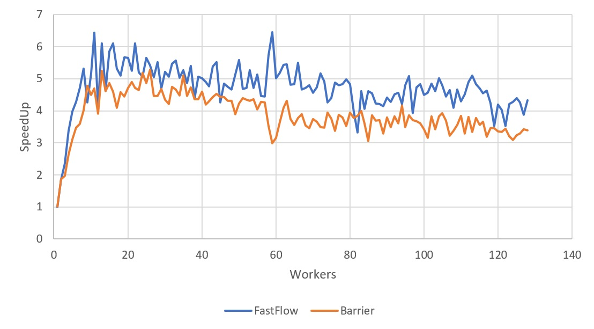
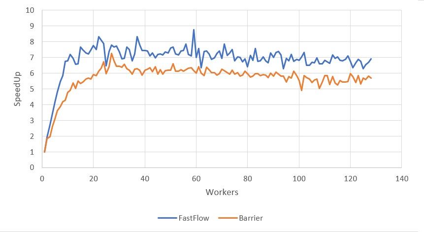

# Parallel Jacobi

A parallel implementation of the Jacobi algorithm for determining the solutions of a strictly diagonally dominant system of linear equations.


## Implementation

The parallel version of this algorithm has been implemented as below:

1. The row vectors of the matrix are equally distributed among the workers.
2. Each process start to compute the sub-result assigned.
3. As the computation of all the workers is ended, the sub-results are collected and joined in a support vector.
4. Repeat since step 1 until convergence.

To speedup the process everythink is done directly inside the instance of the Class Linear System.

Everything has been implemented in three different ways:
- Sequential version, for comparison.
- Thread parallel version, using a barrier as a synchronization point.
- Fastflow version, using the optimized ParallelFor in [fastflow](https://github.com/fastflow/fastflow).


## Structure

```
📦Parallel_Jacobi
 ┣ 📂build
 ┃ ┣ 📜jacobi_fastflow
 ┃ ┣ 📜jacobi_sequential
 ┃ ┗ 📜jacobi_std
 ┣ 📂experiments
 ┃ ┣ 📜amdahl.sh
 ┃ ┣ 📜average.sh
 ┃ ┗ 📜gustaffson.sh
 ┣ 📂fastflow
 ┃ ┗ ...
 ┣ 📂lib
 ┃ ┣ 📜linear_system.hpp
 ┃ ┗ 📜utimer.hpp
 ┣ 📂results
 ┃ ┣ 📜Results.xlsx  # Excel file in which are saved the plots and all the data for comparison purposes
 ┃ ┣ 📜amdahl.txt
 ┃ ┣ 📜amdahl1.txt
 ┃ ┗ 📜gustaf.txt
 ┣ 📜Jacobi_fastflow.cpp
 ┣ 📜Jacobi_sequential.cpp
 ┣ 📜Jacobi_std.cpp
 ┣ 📜Makefile
 ┗ 📜README.md                     
```

## Compiling and running

To compile the program, simply launch from the base directory

```bash
make all
```

Three executable will be created in the build folder, respectively for the sequential, parallel thread and parallel fastflow version.

To run the builds, launch from the base directory

```bash
./build/executable dim iters nw check[0/1]
``` 

where

- **dim**: Shape of the square matrix and of the vectors.
- **iters**: Number of cycle to iterate the Jacobi method.
- **nw**: stands for the maximum parallelism degree to be used. Do not specify this if you are running the sequential version.
- **check**: Boolean for testing puposes: [0] => false, the system will not be shown; [1] => true, the system will be printed.

Instead to run the experiments scripts run

```bash 
bash ./experiments/[amdahl || gustafsson || average].sh
```

## Results

Below are some results of the speedup achieved on a XEON Phi machine, hosting 32 physical cores with 4-way hyperthreading. Hence the maximum **nw** was set to 128 threads.  
The first plot compare the sequential code with ff and std parallel implementations with a matrix of shape(2560, 2560) insted in the second shape(5120, 5120).

<p align="center">


</p>
